# 🔍 LostFound

**LostFound** is a Flutter app that helps users report and find lost items.  
It uses **Supabase** as the backend for authentication, real-time data storage,  
and profile management.  

The app provides a simple and user-friendly interface where users can post  
lost/found items, browse existing reports, and comment on posts.

---

## 🚀 Features

- 📝 Post lost or found items with details and images  
- 🔑 Authentication with Supabase (sign up, login, logout)  
- 💬 Comment on posts with real-time updates  
- 👤 Profile integration → display user **name** & **profile photo** from Supabase  
- 🔄 Real-time data sync using Supabase streams  
- 🎨 Clean and modern UI built with Flutter  
- 📱 Fully responsive design  

---

## 📸 Screenshots

### 🔐 Authentication

<table>
  <tr>
    <td align="center">
      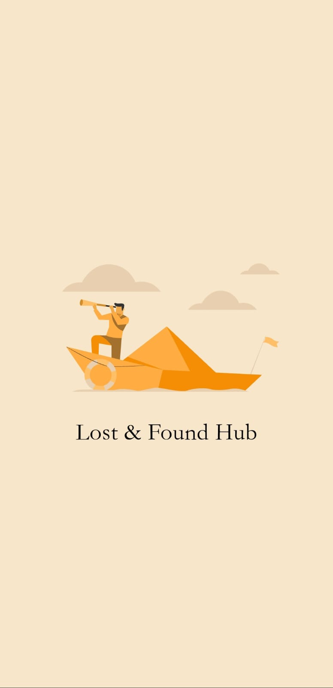<br>
      <b>🏠 Splash Screen</b>
    </td>
    <td align="center">
      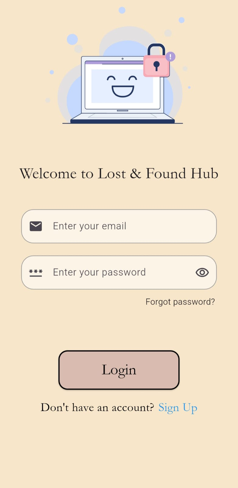<br>
      <b>🔑 Login Page</b>
    </td>
    <td align="center">
      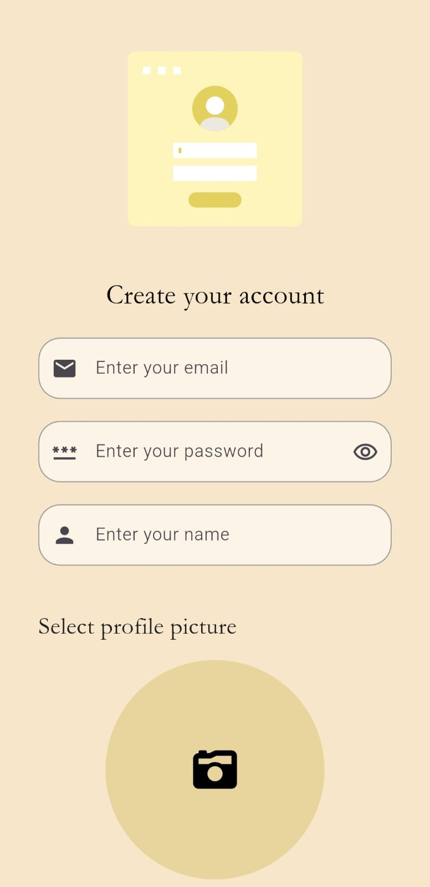<br>
      <b>📝 Sign Up Page</b>
    </td>
    <td align="center">
      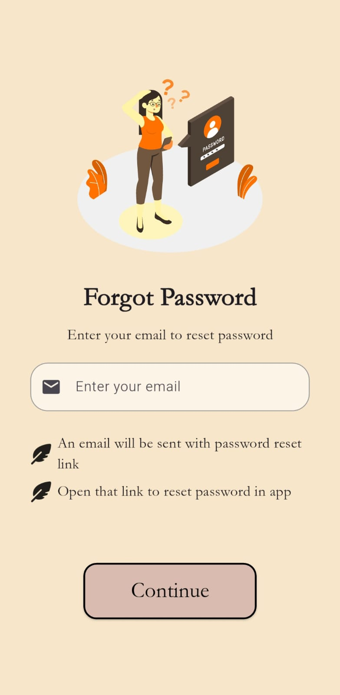<br>
      <b>❓ Forgot Password</b>
    </td>
    <td align="center">
      <br>
      <b>🔄 Reset Password</b>
    </td>
  </tr>
</table>

---

### 🏠 Home Page

<table>
  <tr>
    <td align="center">
      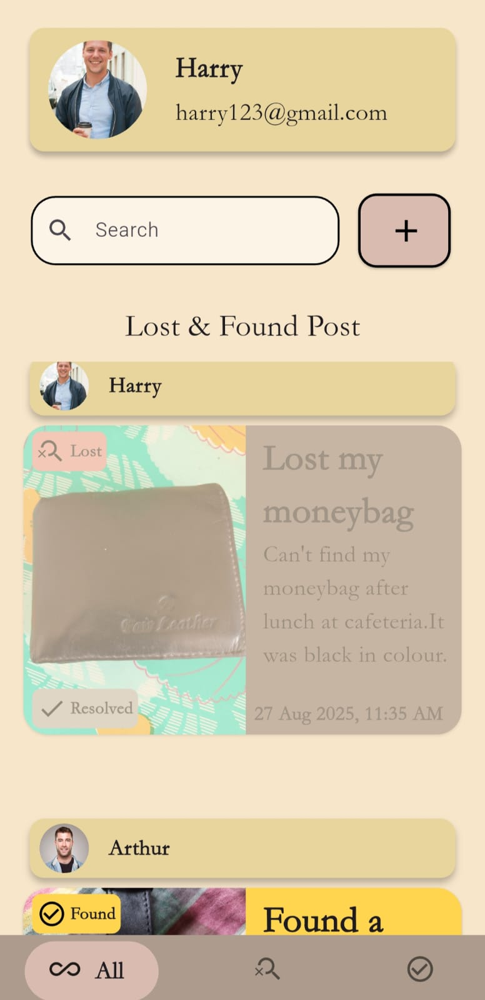<br>
      <b>🏠 Home Page</b>
    </td>
    <td align="center">
      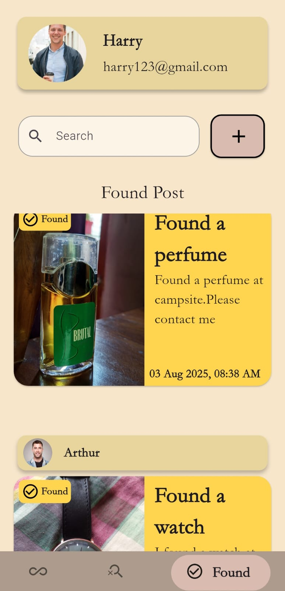<br>
      <b>📦 Bottom Tab Filter: Found</b>
    </td>
    <td align="center">
      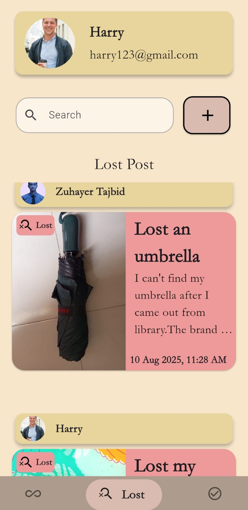<br>
      <b>📦 Bottom Tab Filter: Lost</b>
    </td>
    <td align="center">
      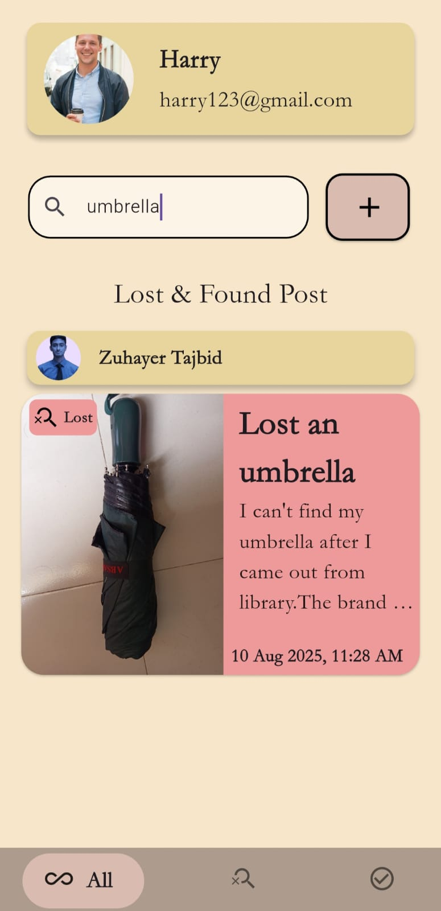<br>
      <b>🔍 Search Bar</b>
    </td>
  </tr>
</table>

---

### ✏️ Create Post

<table>
  <tr>
    <td align="center">
      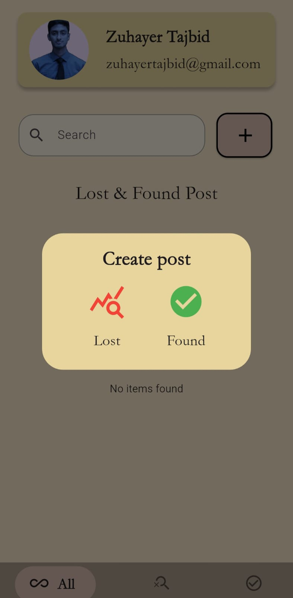<br>
      <b>⚠️ Create Alert Dialogue</b>
    </td>
    <td align="center">
      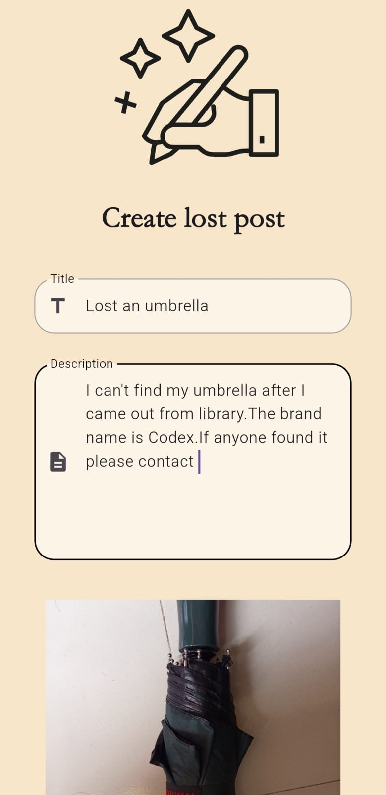<br>
      <b>📝 Create Post (Step 1)</b>
    </td>
    <td align="center">
      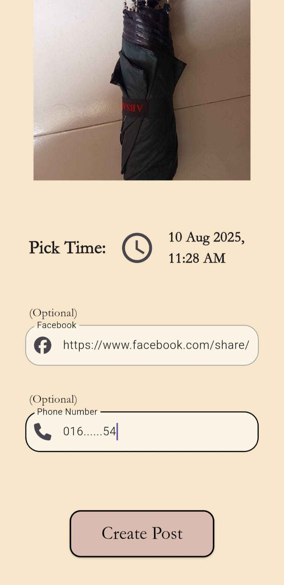<br>
      <b>📝 Create Post (Step 2)</b>
    </td>
  </tr>
</table>

---

### 💬 Lost & Found Page

<table>
  <tr>
    <td align="center">
      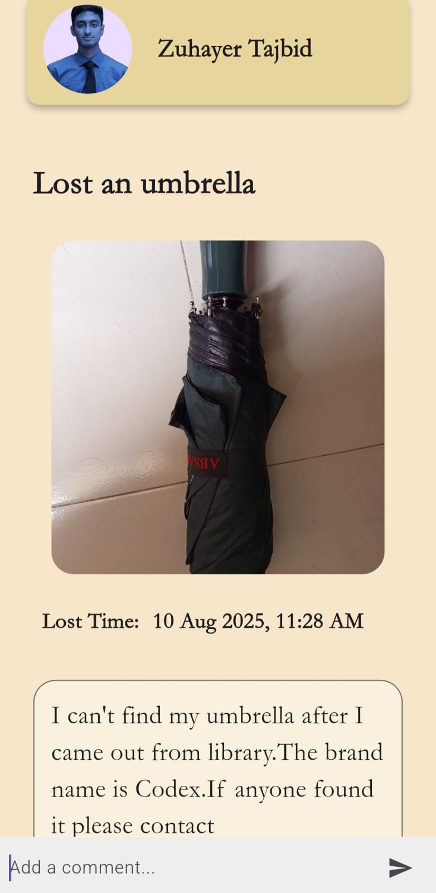<br>
      <b>📄 Lost & Found Page</b>
    </td>
    <td align="center">
      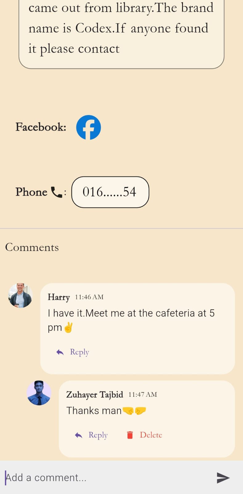<br>
      <b>💬 Comments</b>
    </td>
  </tr>
</table>

---

### 👤 Profile Dashboard

<table>
  <tr>
    <td align="center">
      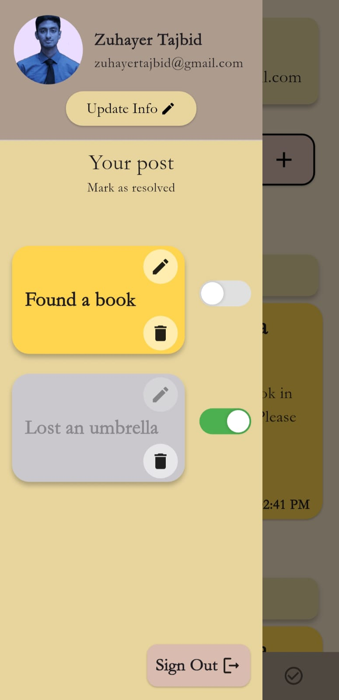<br>
      <b>📊 Dashboard</b>
    </td>
    <td align="center">
      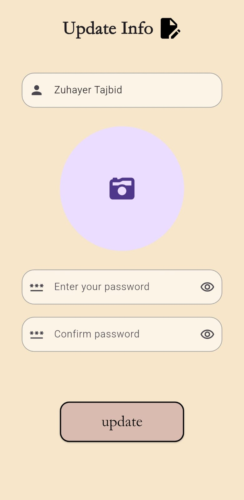<br>
      <b>📝 Update User Info</b>
    </td>
    <td align="center">
      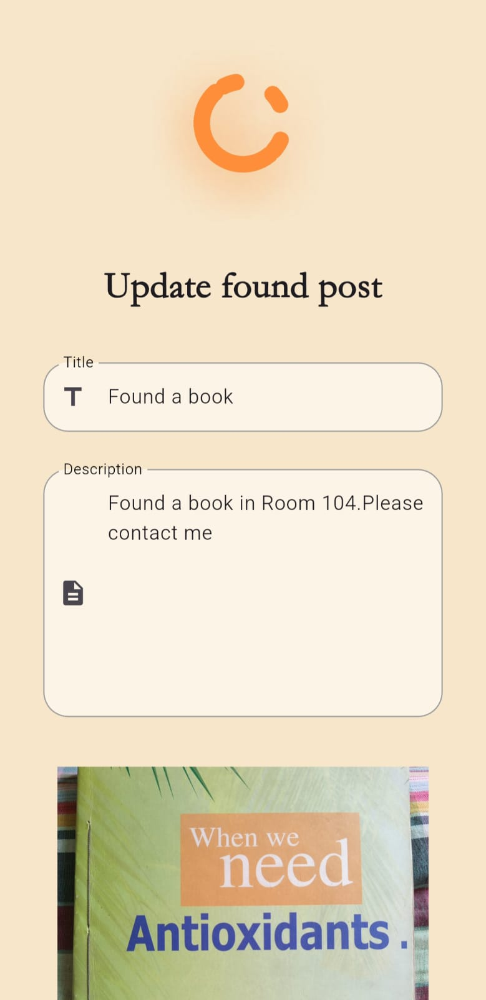<br>
      <b>✏️ Update Post</b>
    </td>
    <td align="center">
      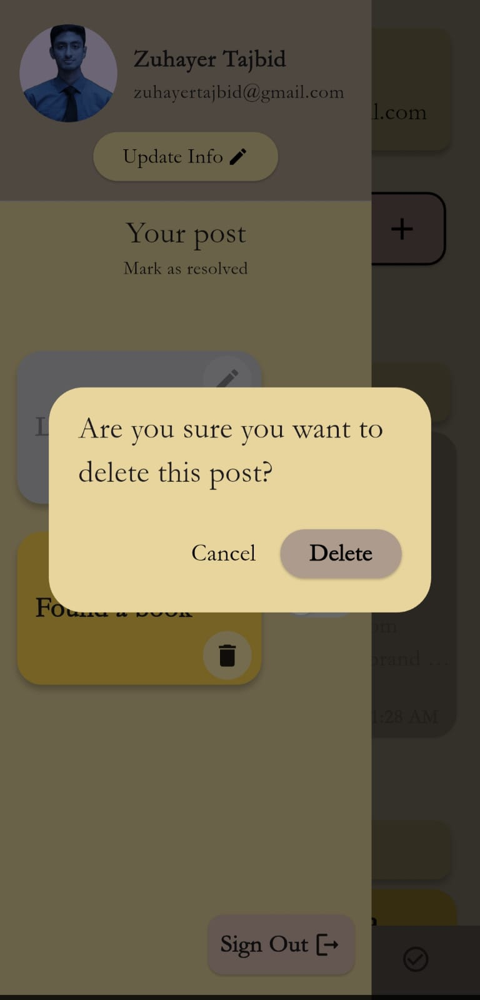<br>
      <b>🗑️ Delete Post</b>
    </td>
  </tr>
</table>

---

## 📱 Download APK

👉 [Download the latest APK](https://github.com/Zuhayer-Tajbid/Lost-Found-Hub/releases/tag/v1.0.0)

---

## 🛠️ Tech Stack

- 🎯 **Flutter** – Cross-platform UI toolkit  
- 🗄️ **Supabase** – Backend (Auth, Database, Storage, Realtime)  
- 🔄 **StreamBuilder** – Real-time UI updates  
- 🎨 **Material Design** – Modern responsive UI  

---

## 📦 Dependencies

```yaml
dependencies:
  flutter:
    sdk: flutter
  cupertino_icons: ^1.0.8
  provider: ^6.1.5+1
  lottie: ^3.3.1
  font_awesome_flutter: ^10.9.1
  supabase_flutter: ^2.9.1
  image_picker: ^1.2.0
  app_links: ^6.4.1
  auto_size_text: ^3.0.0
  intl: ^0.20.2
  google_nav_bar: ^5.0.7
  url_launcher: ^6.3.2
  flutter_launcher_icons: ^0.14.4
